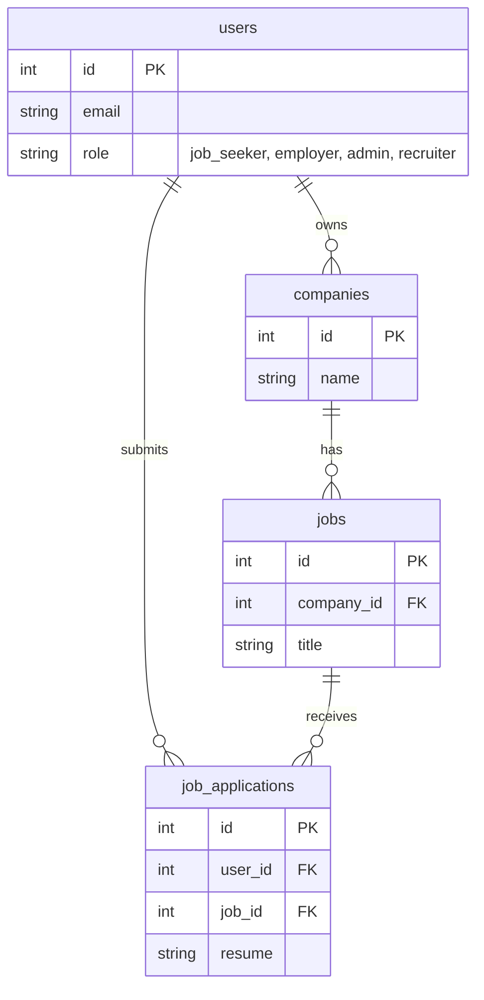
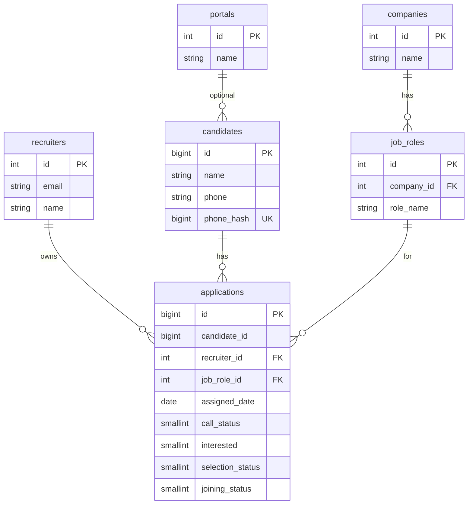

# Jobsmato Database – Simple Diagram & Flow

One database: **`jobsmato_db`** with two main schemas.

---

## 1. Two Schemas at a Glance

```
┌─────────────────────────────────────────────────────────────────────────────┐
│                          PostgreSQL: jobsmato_db                             │
├─────────────────────────────────────┬───────────────────────────────────────┤
│  PUBLIC (Job Portal)                 │  SOURCING (Recruiter / DataLake)      │
│  • users                             │  • recruiters                          │
│  • companies                         │  • portals                             │
│  • jobs                              │  • job_roles  ──────────────► companies│
│  • job_applications (apply for jobs)  │  • candidates                          │
│  • saved_jobs, notifications, etc.     │  • applications (recruiter pipeline)   │
│                                      │  • raw_candidate_logs (ETL input)      │
└─────────────────────────────────────┴───────────────────────────────────────┘
```

---

## 2. Job Portal Flow (public schema)

```
                    ┌──────────┐
                    │  users   │  (job_seeker, employer, admin, recruiter)
                    └────┬─────┘
                         │
         ┌───────────────┼───────────────┐
         │               │               │
         ▼               ▼               ▼
  ┌─────────────┐  ┌──────────┐  ┌─────────────────┐
  │  companies  │  │  jobs    │  │ job_applications│  (Job seeker applies to job)
  │  (employer) │  │          │  │                 │
  └──────┬──────┘  └────┬─────┘  └────────┬────────┘
         │              │                  │
         │              └──────────────────┘
         │                   (job_id, user_id)
         │
         │              Job Portal: Browse jobs → Apply → Employer sees application
         └──────────────────────────────────────────────────────────────────────
```

**Mermaid (copy to [mermaid.live](https://mermaid.live) to view):**



---

## 3. Recruiter / Sourcing Flow (sourcing schema)

```
  users (role=recruiter)     sourcing.recruiters (same email)
         │                              │
         └──────────┬───────────────────┘
                    │
                    ▼
         ┌─────────────────────┐
         │ sourcing.recruiters │
         └──────────┬──────────┘
                    │
    ┌───────────────┼───────────────┐
    │               │               │
    ▼               ▼               ▼
┌─────────┐   ┌──────────────┐   ┌─────────────────┐
│sourcing │   │  sourcing    │   │  public         │
│.portals │   │  .job_roles  │──►│  .companies     │  (read-only for recruiters)
└────┬────┘   └──────┬───────┘   └─────────────────┘
     │               │
     │               │
     ▼               ▼
┌─────────────────────────────────────────────────────────┐
│  sourcing.candidates  (name, phone, email, phone_hash)  │
└────────────────────────────┬────────────────────────────┘
                             │
                             │  candidate_id, recruiter_id, job_role_id
                             │  assigned_date, call_status, interested, etc.
                             ▼
┌─────────────────────────────────────────────────────────┐
│  sourcing.applications  (partitioned by assigned_date)  │
└─────────────────────────────────────────────────────────┘

Recruiter flow: Create candidate → Create application (link candidate + job_role + recruiter) → Update status (call, interested, selection, joining)
```

**Mermaid:**



---

## 4. How the Two Parts Connect

```
                    ┌─────────────────────────────────────────────────┐
                    │                  jobsmato_db                     │
                    └─────────────────────────────────────────────────┘
                                         │
              ┌──────────────────────────┼──────────────────────────┐
              │                          │                          │
              ▼                          ▼                          ▼
     ┌────────────────┐        ┌────────────────┐        ┌────────────────┐
     │ PUBLIC         │        │ SOURCING       │        │ Link           │
     │ Job Portal     │        │ Recruiter      │        │                │
     │                │        │                │        │  companies    │
     │ users          │        │ recruiters     │        │  (public)      │
     │ companies      │◄───────│ job_roles ────┼───────►│  used by       │
     │ jobs           │        │ candidates     │        │  job_roles     │
     │ job_applications│       │ applications   │        │  (sourcing)   │
     └────────────────┘        └────────────────┘        └────────────────┘
```

- **Job portal**: `users` → `companies` → `jobs` → `job_applications` (all in **public**).
- **Recruiter portal**: `sourcing.recruiters` ↔ `users` (by email). Recruiter creates `sourcing.candidates` and `sourcing.applications`; `sourcing.job_roles` points to **public** `companies` (read-only for recruiters).

---

## 5. Where Data Is Written (simple flow)

| Who / What              | Reads From                    | Writes To                                      |
|-------------------------|-------------------------------|------------------------------------------------|
| **Job seeker**          | jobs, companies              | job_applications (public)                      |
| **Employer**            | jobs, companies, job_applications | companies, jobs (public)                  |
| **Recruiter (API)**     | companies, sourcing.*        | sourcing.candidates, sourcing.applications, sourcing.job_roles |
| **ETL / Bulk import**   | sourcing.raw_candidate_logs  | sourcing.recruiters, portals, job_roles, candidates, applications |

---

## 6. Quick Reference – Main Tables

| Schema   | Table             | Purpose                                      |
|----------|-------------------|----------------------------------------------|
| public   | users             | All logins (job seeker, employer, admin, recruiter) |
| public   | companies         | Companies (job portal + used by sourcing job_roles) |
| public   | jobs              | Job postings (job portal)                    |
| public   | job_applications  | “Apply for job” (job seeker → job)           |
| sourcing | recruiters        | Recruiter profile (email matches users)      |
| sourcing | portals           | Source portals (optional for candidates)     |
| sourcing | job_roles         | Role per company (company_id → public.companies) |
| sourcing | candidates        | Candidates (recruiter-created, dedup by phone) |
| sourcing | applications      | Recruiter pipeline (candidate + job_role + statuses) |
| sourcing | raw_candidate_logs| Raw ETL input (partitioned by imported_at)   |

---

## 7. Viewing the Mermaid diagrams

- Paste the Mermaid blocks into [mermaid.live](https://mermaid.live) to view or edit.
- Many IDEs and GitHub render Mermaid in `.md` files.

If you want, we can add one more diagram (e.g. “Login → Job Portal vs Recruiter Portal” or “ETL flow raw → applications”) in the same file.
